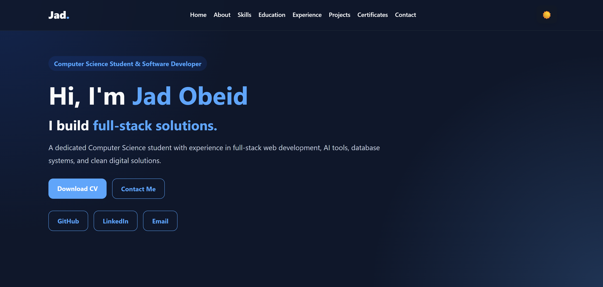

# 🌐 Personal Portfolio Website

A modern, responsive personal portfolio website developed as part of the Synent Technologies Web Development Internship.

## ✨ Features

- Responsive design for desktop, tablet, and mobile
- Dark / Light mode
- Smooth scrolling navigation
- Typing animation
- Education & Experience timeline
- Skills section
- Projects showcase
- Certifications section
- Contact form
- Download CV button

## 🛠️ Technologies Used

- HTML5
- CSS3
- JavaScript

## 📂 Project Structure

```
task1-portfolio/
│
├── index.html
├── style.css
├── script.js
├── assets/
│   └── JadCV.pdf
└── images/
```

## 🚀 Getting Started

1. Clone the repository

```bash
git clone https://github.com/jad-obeidd/synent-task1-portfolio-jadobeid.git
```

2. Open `index.html` in your browser.

## 📸 Preview



## 🌐 Live Demo

https://jad-obeidd.github.io/synent-task1-portfolio-jadobeid/

## 👨‍💻 Author

**Jad Obeid**

- GitHub: https://github.com/jad-obeidd
- LinkedIn: https://linkedin.com/in/jad-obeid-748a642a0

## 📄 License

This project was developed for educational and internship purposes.

## 🌐 Live Demo

https://jad-obeidd.github.io/synent-task1-portfolio-jadobeid/
